# Lily58 ZMK Config

ZMK configuration files for my Lily58 mechanical keyboard. Forked from [mctechnology17/zmk-config](https://github.com/mctechnology17/zmk-config)

Widgets can be found at [Furglitch/zmk-niceview](https://github.com/Furglitch/zmk-niceview)

## Hardware

- Lily58 kit, nice!nano microcontroller, nice!view display, no-solder hotswap headers, from [Typeractive](https://typeractive.xyz/pages/build#lily58_mx)
- Gateron EF Grayish Tactile Switches, 58 count, from [MechanicalKeyboards](https://mechanicalkeyboards.com/products/gateron-ef-grayish-59g-tactile-pcb-mount)
- Ducky Blank Cherry Profile PBT keycaps, from [MechanicalKeyboards](https://mechanicalkeyboards.com/products/ducky-black-blank-132-key-cherry-profile-pbt-keycap-set?_pos=6&_sid=f48a638f6&_ss=r)
- 652030 350mAh LiPo battery, from [Amazon](https://www.amazon.com/s?k=652030+lipo+battery)
- Manta58/s Case, from [Makerworld](https://makerworld.com/en/models/671684-manta58-s-split-keyboard-case-for-lily58-pcbs). Printed in Elegoo translucent resin, from [Amazon](https://www.amazon.com/dp/B0D7BPXBBF). Resin dyed for 'atomic purple' coloring, from [Amazon](https://www.amazon.com/dp/B07V1DQPP6). Slightly modified for battery pocket.

*All of these were purchased, not provided. 'From' just means that's where I bought it.*

## Keymap

